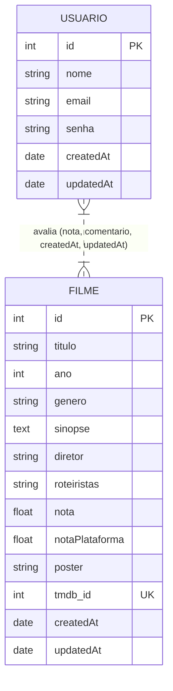
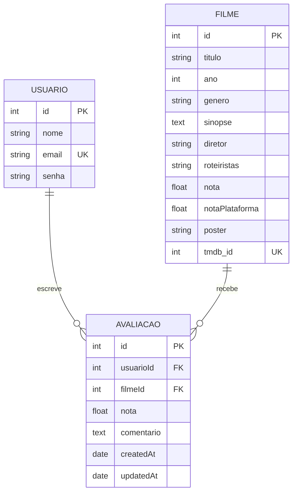

# 🎬 Modelo Conceitual do Banco de Dados - LetterBoxed

Este documento apresenta a especificação completa do banco de dados relacional do projeto **LetterBoxed**, estruturado sob as melhores práticas acadêmicas e profissionais para disciplinas de Banco de Dados.

O documento está dividido em três níveis de modelagem: **Conceitual**, **Lógico** e **Físico**, além de detalhar as regras de negócio e restrições de integridade aplicadas ao sistema.

---

## 1. Modelo Conceitual (MER - Modelo Entidade-Relacionamento)

No nível conceitual, o banco de dados representa os elementos do mundo real (entidades), suas características (atributos) e como se relacionam entre si (relacionamentos).

### 1.1. Abordagem 1: Avaliação como Relacionamento Muitos-para-Muitos ($M:N$) com Atributos
*Esta é a abordagem conceitual clássica (MER de Peter Chen), onde a avaliação é um relacionamento entre Usuário e Filme carregando atributos próprios.*



### 1.2. Abordagem 2: Avaliação como Entidade Associativa
*Abordagem conceitual/lógica alternativa (comumente exigida por professores para facilitar o mapeamento físico), onde a **Avaliação** é representada como uma entidade associativa com sua própria chave primária identificadora.*



---

## 2. Descrição Detalhada das Entidades e Atributos

### 2.1. Entidade: `Usuario` (Usuário)
Representa as pessoas cadastradas na plataforma (como alunos e professores) que podem interagir com os filmes e fazer críticas.

*   **`id`** (Inteiro): Atributo Identificador (Chave Primária). Gerado automaticamente pelo sistema de forma sequencial (auto-incremento).
*   **`nome`** (Texto/Varchar): Nome completo do usuário. Atributo simples, monovalorado e obrigatório.
*   **`email`** (Texto/Varchar): Endereço de correio eletrônico do usuário. Atributo simples, obrigatório e **único** (chave alternativa/candidata) para garantir que não haja cadastros duplicados. Deve seguir um formato válido de e-mail.
*   **`senha`** (Texto/Varchar): Hash criptografado da senha do usuário (gerado com bcrypt). Atributo simples, monovalorado e obrigatório para controle de acesso seguro.
*   **`createdAt` / `updatedAt`** (Data/Hora): Atributos de controle temporal (auditoria), registrando a data de criação do perfil e da última atualização, respectivamente.

### 2.2. Entidade: `Filme` (Filme)
Armazena o acervo de obras cinematográficas disponíveis para busca, catalogação e avaliação.

*   **`id`** (Inteiro): Atributo Identificador (Chave Primária). Gerado automaticamente de forma sequencial.
*   **`titulo`** (Texto/Varchar): Título oficial do filme. Atributo simples e obrigatório.
*   **`ano`** (Inteiro): Ano de lançamento nos cinemas. Atributo simples e opcional.
*   **`genero`** (Texto/Varchar): Gêneros atribuídos ao filme (ex: "Ação, Ficção Científica"). Atributo simples e opcional.
*   **`sinopse`** (Texto/Text): Descrição longa ou resumo do enredo. Atributo simples e opcional.
*   **`diretor`** (Texto/Varchar): Nome do diretor principal da obra. Atributo simples e opcional.
*   **`roteiristas`** (Texto/Varchar): Nomes dos roteiristas envolvidos. Atributo simples e opcional.
*   **`nota`** (Real/Float): **Atributo Derivado (Calculado)**. Representa a média aritmética simples das notas dadas pelos usuários locais da plataforma para este filme.
*   **`notaPlataforma`** (Real/Float): Nota oficial média do filme obtida de uma API externa (TmDB). Atributo simples e opcional.
*   **`poster`** (Texto/Varchar): Caminho de URL ou arquivo para a imagem de capa do filme. Atributo simples e opcional.
*   **`tmdb_id`** (Inteiro): Identificador exclusivo do filme na base de dados externa do TmDB (The Movie Database). Atributo simples, opcional e **único** (chave alternativa).
*   **`createdAt` / `updatedAt`** (Data/Hora): Atributos de auditoria gerados automaticamente.

### 2.3. Entidade: `Avaliacao` (Avaliação)
Entidade associativa (ou relacionamento) que une um **Usuário** a um **Filme**, materializando o ato de avaliar e criticar uma produção.

*   **`id`** (Inteiro): Atributo Identificador (Chave Primária). Gerado sequencialmente de forma automática.
*   **`nota`** (Real/Float): Valor numérico atribuído pelo usuário ao filme. Atributo simples e obrigatório. Possui restrição de domínio: deve estar contida obrigatoriamente no intervalo **[0.0, 10.0]**.
*   **`comentario`** (Texto/Text): Texto dissertativo contendo a crítica ou resenha escrita pelo usuário. Atributo simples e opcional.
*   **`usuarioId`** (Inteiro): Chave Estrangeira (FK). Referencia o usuário que realizou a avaliação.
*   **`filmeId`** (Inteiro): Chave Estrangeira (FK). Referencia o filme que recebeu a avaliação.
*   **`createdAt` / `updatedAt`** (Data/Hora): Registram quando a crítica foi publicada e se foi editada posteriormente.

---

## 3. Relacionamentos e Cardinalidades

O modelo é regido por dois relacionamentos conceituais clássicos que formam uma relação Muitos-para-Muitos ($M:N$):

### 3.1. Usuário $\rightarrow$ Avaliação (`1:N`)
*   **Significado:** Um usuário pode escrever várias avaliações de filmes distintos ao longo do tempo. No entanto, cada avaliação específica pertence a um único usuário.
*   **Cardinalidade:** `1:N` (Um para Muitos).
*   **Participação (Opcionalidade):**
    *   **Usuário (0,N):** Um usuário cadastrado não é obrigado a avaliar nenhum filme para manter sua conta ativa (participação opcional).
    *   **Avaliação (1,1):** Uma avaliação não pode existir flutuando no banco; ela obrigatoriamente precisa estar associada a exatamente um usuário (participação total/obrigatória).

### 3.2. Filme $\rightarrow$ Avaliação (`1:N`)
*   **Significado:** Um filme do catálogo pode receber críticas e notas de múltiplos usuários diferentes. Ao mesmo tempo, uma avaliação específica se refere a apenas um filme.
*   **Cardinalidade:** `1:N` (Um para Muitos).
*   **Participação (Opcionalidade):**
    *   **Filme (0,N):** Um filme recém-adicionado ao catálogo pode ainda não ter recebido nenhuma crítica (participação opcional).
    *   **Avaliação (1,1):** Uma avaliação obrigatoriamente precisa estar vinculada a exatamente um filme cadastrado (participação total/obrigatória).

### 3.3. Relacionamento Geral Equivalente: Usuário $\leftrightarrow$ Filme (`M:N`)
Através da tabela intermediária de Avaliações, as entidades **Usuário** e **Filme** possuem um relacionamento clássico **Muitos-para-Muitos (N:M)**, no qual:
*   Um usuário avalia de $0$ a $N$ filmes.
*   Um filme é avaliado por $0$ a $N$ usuários.

---

## 4. Modelo Lógico (Mapeamento para o Esquema Relacional)

O mapeamento conceitual-lógico transforma as entidades e relacionamentos em tabelas bidimensionais, declarando as Chaves Primárias (PK), Chaves Estrangeiras (FK) e regras de integridade referencial.

### 4.1. Representação Textual (Esquema Relacional)

*   **`usuarios`** (
        **id** (PK) `INT AUTO_INCREMENT`,
        `nome` `VARCHAR(255) NOT NULL`,
        `email` `VARCHAR(255) NOT NULL UNIQUE`,
        `senha` `VARCHAR(255) NOT NULL`,
        `createdAt` `TIMESTAMP NOT NULL`,
        `updatedAt` `TIMESTAMP NOT NULL`
    )

*   **`filmes`** (
        **id** (PK) `INT AUTO_INCREMENT`,
        `titulo` `VARCHAR(255) NOT NULL`,
        `ano` `INT`,
        `genero` `VARCHAR(255)`,
        `sinopse` `TEXT`,
        `diretor` `VARCHAR(255)`,
        `roteiristas` `VARCHAR(255)`,
        `nota` `FLOAT DEFAULT 0`,
        `notaPlataforma` `FLOAT DEFAULT 0`,
        `poster` `VARCHAR(255)`,
        `tmdb_id` `INT UNIQUE`,
        `createdAt` `TIMESTAMP NOT NULL`,
        `updatedAt` `TIMESTAMP NOT NULL`
    )

*   **`avaliacoes`** (
        **id** (PK) `INT AUTO_INCREMENT`,
        `nota` `FLOAT NOT NULL`,
        `comentario` `TEXT`,
        **usuarioId** (FK) `INT` referenciando `usuarios(id)` `ON DELETE CASCADE`,
        **filmeId** (FK) `INT` referenciando `filmes(id)` `ON DELETE CASCADE`,
        `createdAt` `TIMESTAMP NOT NULL`,
        `updatedAt` `TIMESTAMP NOT NULL`
    )

---

## 5. Regras de Integridade e Restrições de Negócio

Para garantir a consistência e a higienização dos dados armazenados, o banco implementa as seguintes regras:

1.  **Integridade de Entidade:** Todas as tabelas possuem chaves primárias (`id`) que são numéricas, únicas e não nulas.
2.  **Integridade Referencial:**
    *   `avaliacoes.usuarioId` referencia obrigatoriamente um ID existente na tabela `usuarios`.
    *   `avaliacoes.filmeId` referencia obrigatoriamente um ID existente na tabela `filmes`.
3.  **Ação de Integridade Referencial (`ON DELETE CASCADE`):**
    *   Se um **Usuário** for excluído do sistema, todas as suas avaliações correspondentes na tabela `avaliacoes` serão apagadas automaticamente em cascata para evitar órfãos.
    *   Se um **Filme** for excluído do catálogo, todas as críticas e avaliações associadas a ele na tabela `avaliacoes` também serão deletadas em cascata.
4.  **Restrição de Unicidade (Unique Constraints):**
    *   `usuarios.email`: impede que dois usuários compartilhem o mesmo e-mail no sistema.
    *   `filmes.tmdb_id`: impede que o mesmo filme seja duplicado ou cadastrado mais de uma vez através da integração externa.
5.  **Restrição de Domínio (Check Constraints):**
    *   `avaliacoes.nota` deve respeitar o limite real: `0.0 <= nota <= 10.0`. Notas fora desse escopo são rejeitadas pela camada de validação e restrição do banco.

---

## 6. Modelo Físico (Código DDL em SQL)

*Este é o código SQL nativo (compatível com PostgreSQL) que cria exatamente a estrutura lógica acima descrita, útil para apresentação em relatórios práticos de laboratório.*

```sql
-- Criar a tabela de Usuários
CREATE TABLE IF NOT EXISTS usuarios (
    id SERIAL PRIMARY KEY,
    nome VARCHAR(255) NOT NULL,
    email VARCHAR(255) NOT NULL UNIQUE,
    senha VARCHAR(255) NOT NULL,
    "createdAt" TIMESTAMP WITH TIME ZONE NOT NULL,
    "updatedAt" TIMESTAMP WITH TIME ZONE NOT NULL
);

-- Criar a tabela de Filmes
CREATE TABLE IF NOT EXISTS filmes (
    id SERIAL PRIMARY KEY,
    titulo VARCHAR(255) NOT NULL,
    ano INTEGER,
    genero VARCHAR(255),
    sinopse TEXT,
    diretor VARCHAR(255),
    roteiristas VARCHAR(255),
    nota FLOAT DEFAULT 0,
    "notaPlataforma" FLOAT DEFAULT 0,
    poster VARCHAR(255),
    tmdb_id INTEGER UNIQUE,
    "createdAt" TIMESTAMP WITH TIME ZONE NOT NULL,
    "updatedAt" TIMESTAMP WITH TIME ZONE NOT NULL
);

-- Criar a tabela de Avaliações
CREATE TABLE IF NOT EXISTS avaliacoes (
    id SERIAL PRIMARY KEY,
    nota FLOAT NOT NULL CHECK (nota >= 0 AND nota <= 10),
    comentario TEXT,
    "usuarioId" INTEGER REFERENCES usuarios(id) ON DELETE CASCADE,
    "filmeId" INTEGER REFERENCES filmes(id) ON DELETE CASCADE,
    "createdAt" TIMESTAMP WITH TIME ZONE NOT NULL,
    "updatedAt" TIMESTAMP WITH TIME ZONE NOT NULL
);
```

---

## 7. Mapeamento de Paradigma: Objeto-Relacional (ORM)

Na aplicação **LetterBoxed**, a persistência é orquestrada pelo framework **Sequelize** em Node.js. O diagrama abaixo descreve como as classes javascript (modelos) mapeiam diretamente para as tabelas físicas do PostgreSQL.

```text
  [Camada de Aplicação - Models JS]           [Camada de Dados - PostgreSQL]
 ┌────────────────────────────────┐         ┌────────────────────────────────┐
 │ model/Usuario.js               │  ====>  │ tabela: usuarios               │
 │ (id, nome, email, senha)       │         │ (id, nome, email, senha)       │
 └────────────────────────────────┘         └────────────────────────────────┘
                                  \         /
                                   \       /
 [Camada de Associação - index.js]  \     /
 ┌────────────────────────────────┐  \   /  ┌────────────────────────────────┐
 │ Usuario.hasMany(Avaliacao)     │ ======= │ tabela: avaliacoes             │
 │ Filme.hasMany(Avaliacao)       │   / \   │ (id, nota, comentario,         │
 └────────────────────────────────┘  /   \  │  usuarioId, filmeId)           │
                                    /     \ └────────────────────────────────┘
                                   /       \
 ┌────────────────────────────────┐         ┌────────────────────────────────┐
 │ model/Filme.js                 │  ====>  │ tabela: filmes                 │
 │ (id, titulo, ano, genero, etc) │         │ (id, titulo, ano, genero, etc) │
 └────────────────────────────────┘         └────────────────────────────────┘
```

Este mapeamento garante que consultas complexas, como buscar todos os comentários de um usuário ou as avaliações médias de um filme, possam ser feitas utilizando JavaScript puro e traduzidas eficientemente para instruções SQL `JOIN` sob o capô.
